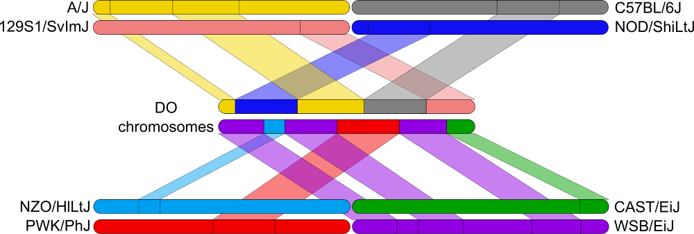

## Learning Objectives 

* Explore data from Diversity Outbred (DO) mice.
* Map a behavioral trait.
* Search for non-synonymous SNPs in candidate genes.
* Search for candidate genes in brain gene expression data. 


 


## Mapping QTL in Diversity Outbred Mice 

We will be mapping behavioral phenotypes from Dr. Elissa Chesler's group in [Diversity Outbred (DO)  Mice](http://jaxmice.jax.org/strain/009376.html). The Open Field Test was conducted on 272 DO mice (140 females & 132 males). In the Open Field Test, mice are placed in an open arena for 20 minutes and are scored for the amount of time that they spend in the center, corners and periphery of the arena. These values are tallied in 4 minute bins. Summary measures such as the total distance traveled and the slope of behavior across the time bins are then computed. At necropsy, brain tissue was harvested and transcript levels in the hippocampus were measured via RNASeq. All of the mice were genotyped at 7,654 markers on the first generation [Mouse Universal Genotyping Array (MUGA)](http://www.neogen.com/Genomics/pdf/Slicks/MegaMUGAFlyer.pdf).

In this tutorial, we will map behavioral traits. We will perform linkage mapping using the DO haplotype reconstructions and then perform association mapping using imputed SNPs from the DO founders. We will search for candidate genes that change protien structure or gene expression.  You will then map a behavioral trait that you choose.

## Exercises
### Libraries and Data Import

First, we will load the R libraries that we need to perform the analysis. These include [DOQTL](http://bioconductor.org/packages/release/bioc/html/DOQTL.html), a package designed to map traits in DO mice, [VariantAnnotation](https://bioconductor.org/packages/release/bioc/html/VariantAnnotation.html), a package that reads data from the SNP files in Variant Call Format (VCF)  and [AnnotationHub](https://bioconductor.org/packages/release/bioc/html/AnnotationHub.html), a package that accesses a wide variaty of organism annotation data.

```{r, results='hide',message=FALSE,warning=FALSE}
options(na.action = na.pass)
library(DOQTL)
library(VariantAnnotation)
library(AnnotationHub)
```

We will be working with data that is stored locally on your cloud machine. For the first exercise, we will map the slope of the time spent in the center of the arena. This is the slope of the percent of time spent in the center in each of the 4 minute time bins. In order to map the trait, we need two pieces of information on each mouse:

1. Phenotype measurements on a set of DO mice,
2. Genotypes across the genome for the same set of DO mice.

All of the data for this tutorial is stored in a compressed R binary files that end with `rds`. You load an RDS file in using the `readRDS()` command. We will first load in the phenotypes.

```{r load_pheno,warning=FALSE}
pheno = readRDS("data/ibangs_phenotypes.rds")
```

This command loaded an R object called 'pheno' into the environment. Look at the **Environment** tab in the upper left panel of your RStudio window to see it.

Let's look at the phenotype data.  It is a large matrix with `r nrow(pheno)` rows and `r ncol(pheno)` columns. You are required to have the sample IDs in the rownames of your phenotype type data. Let's look at the file.

Type: `View(pheno)` into your command window.  This will bring up the file in a new tab.

The rows contain sample IDs (EJC1, EJC10, EJC100, etc.) and the columns contain information about each mouse and phenotype measurements from the Open Field Test.

Next, let's look at the distribution of one of the `Pct.Time.Corner.Slope`.

```{r pheno_hist,warning=FALSE}
hist(pheno$Pct.Time.Corner.Slope, breaks = 20, main = "Pct.Time.Corner.Slope")
```

The histogram appeared in the *Plots* tab in the lower right panel. The trait is normally distributed with one high outlier. This may affect the mapping results and a more in depth analysis would compare the results with and without the outlier mouse.

Next, let's look at the haplotype probabilities. 

```{r load_haplo}
probs = readRDS("data/ibangs_haploprobs.rds")
```

`probs` is a three dimensional numeric array. The `r nrow(probs)` samples are in rows, the `r ncol(probs)` DO founders are in columns and the `r dim(probs)[3]` markers are in slices. Again, as with the expression data, you are required to have sample IDs in rownames.

Let's look at the haplotype probabilities for one marker.

```{r probs_image,warning=FALSE}
image(1:ncol(probs), 1:20, t(probs[20:1,,1]), axes = F, ann = F,
      breaks = c(-0.25, 0.25, 0.75, 1.25), col = c("white", "grey50", "black"))
box()
abline(v = 0:9+0.5, col = "grey80")
abline(h = 0:20+0.5, col = "grey80")
mtext(side = 3, line = 0.5, at = 1:8, text = LETTERS[1:8], cex = 1.5)
mtext(side = 2, line = 0.5, at = 20:1, text = rownames(probs)[1:20], las = 1)
```

The cells are colored black, grey and white for probabilities near 1, 0.5 and 0, respectively.  Samples are in rows and the eight DO founders, coded as `A` to `H`, are in the columns. Look at sample EJC1. It has black cell in the `A` column, indicating that it carries two copies of the A/J allele.  Sample EJC10 has grey cell in the `B` and `D` columns, indicating that it carries a C57BL/6J and an NOD/ShiLtJ allele at this marker.

Next we will load in the marker locations. These are stored on the public [FTP server at The Jackson Laboratory](ftp://ftp.jax.org/MUGA).

```{r load_snps}
load(url("ftp://ftp.jax.org/MUGA/muga_snps.Rdata"))
snps = muga_snps[muga_snps[,1] %in% dimnames(probs)[[3]],]
rm(muga_snps)
```

This loaded in an object called `snps` into the environment. `snps` is a data.frame with `r nrow(snps)` markers, the same size as the number of marekrs in `probs`.

Next, we will create a kinship matrix using the haplotype probabilities in `probs`. A kinship matrix contains the degree of relatedness between each pair of mice. In this case, we will create a different kinship matrix for each chromosome. We calculate the kinship matrix on each chromosome using the markers from all of the other chromosomes, excluding the markers on the current chromosome. For example, on Chr 1, we would calculate the kinship between mice using markers on Chr 2 through Chr X.  This has been shown to increase power for some QTL. The acronym LOCO stands for *Leave One Chromosome Out*. 

```{r kinship,message=FALSE,warning=FALSE}
K = kinship.probs(probs = probs, snps = snps, bychr = TRUE)
```

### Mapping a Behavioral Trait

We will first create a matrix of covariates to use in the mapping model. DOQTL requires a covariate called `sex` because it is used to map on the X chromosome. We will also use DO outbreeding generation as a covariate. There are three important points to remember with covariates.

1. Covariates must be numeric,
2. Covariates must have rownames that contain the same sample IDs as the phenotypes,
3. Covariates must have one column called `sex`.

```{r covar,warning=FALSE}
covar = model.matrix(~Sex + Generation, data = pheno)[,-1]
colnames(covar)[1] = "sex"
```

At this point, we have five objects in memory that are required for a mapping experiment:

1. pheno: the phenotypes that we have measured,
2. probs: the haplotype probabilities from the same mice,
3. snps: the marker locations for the haplotype probabilities,
4. K: a list of kinship matrices that estiamtes the relationships between mice,
5. covar: a set of covariates that are needed for mapping.

The main function for linkage mapping, in which we regress the phenotype on the haplotype probabilities, is called `scanone()`. `scanone()` uses the sample IDs in the phenotype, covariates, probabilities and kinship matrices to line up the samples. This means that sample IDs are required in the rownames of all of these objects.

```{r linkage,warning=FALSE}
qtl = scanone(pheno = pheno, pheno.col = "Pct.Time.Center.Slope", 
              probs = probs, K = K, addcovar = covar, snps = snps)
```

Note that `scanone()` tells you the number of samples and markers that it is using.  If you provided 272 samples and it's only using 100 samples, then it is likely that your sample IDs don't agree between `pheno`, `probs` and `covar` or you have a lot of missing data.  `scanone()` produces a DOQTL object that contains the LOD scores and the founder allele effects. Next, we will plot the genome scan.

```{r linkage_plot,warning=FALSE}
plot(qtl, main = "Pct.Time.Center.Slope")
```

There are some peaks that look large, but we need some way to decide which ones are significant. To do this, we will load in previously computed permutations. We ran 1000 permutations and retained the maximum LOD score from each one.

```{r linkage_perms,warning=FALSE}
link_perms = readRDS("data/linkage_perms.rds")
thr = get.sig.thr(link_perms, alpha = c(0.05, 0.63))
```

Let's plot the distrubtion of maximum LOD scores in the permutations.

```{r perms_hist,warning=FALSE}
hist(link_perms[,1], breaks = 20)
abline(v = thr[1,1], col = "red", lwd = 2)
```

This is the distribution of the maximum LOD scores across the permutations. The red line is the 95th percentile of the distribution. LOD scores that are above this threshold will occur by chance 5% of the time. We call this an alpha = 0.05 genome-wide threshold.

Let's add the 0.05 and 0.63 thresholds to the QTL plot.

```{r linkage_plot2,warning=FALSE}
plot(qtl, main = "Pct.Time.Center.Slope", sig.thr = thr,
     sig.col = c("red", "goldenrod"))
```

We can see that two peaks cross the lower threshold, one on Chr 2 and one on Chr 4. Let's look more closely at the peak on Chr 4. The mapping model produces an estimate of the effect of each of the eight founder alleles. We can plot these on one chromosome using `coefplot()`.


```{r coefplot,warning=FALSE}
coefplot(qtl, chr = 4, main = "Pct.Time.Center.Slope")
```

Each of the eight colored lines in the top plot represents the effect of one of the eight founders. The LOD plot is shown on the bottom. At the peak near 150Mb, the allele effects split into two groups. DO mice that carry the PWK/PhJ allele have lower slope than other DO mice. Look to the right near 74 Mb. The founder effects separate from each other.  But is this split significant? What would you use to decide if there is another peak at 74 Mb?


Next, we can use the haplotype reconstructions to impute the DO founder SNPs onto DO genomes. We do this by copying SNPs from the [Sanger Mouse Genomes Project](http://www.sanger.ac.uk/resources/mouse/genomes/) and pasting them into the haplotype blocks for each DO mouse.



Although we genotyped the DO mice at 7,654 markers, we now have 40 million SNPs imputed onto each DO mouse  We can use these to perform genome-wide association mapping at each SNP.  To do this, we will use `scanone.assoc()`, which takes a set of arguments similar to `scanone()`. The biggest difference is that `scanone.assoc()` needs a special file containing information about the 40 million founder SNPs. This file is called 'DO_Sanger_SDPs.txt.bgz' and it can be downloaded from the [JAX FTP site](ftp://ftp.jax.org/MUGA/).  When you run DOQTL at home, you will need to download both 'DO_Sanger_SDPs.txt.bgz' and 'DO_Sanger_SDPs.txt.bgz.tbi' and place them in the same directory. Then you will point `scanone.assoc()` to their location using the `sdp.file` argument.  Here, we have loaded them into the 'data' directory on your cloud machine.

```{r gwas,warning=FALSE}
gwas = scanone.assoc(pheno = pheno, pheno.col = "Pct.Time.Center.Slope",
       probs = probs, K = K, addcovar = covar, markers = snps, ncl = 1,
       sdp.file = "data/DO_Sanger_SDPs.txt.bgz")
```

Next, we load in the pre-computed permutations for the GWAS.

```{r load_gwas_perms,warnings=FALSE}
assoc_perms = readRDS("data/assoc_perms.rds")
thr = get.sig.thr(-log10(assoc_perms))
```

We will plot the GWAS results with a red line at the alpha = 0.05 significance level.

```{r gwas_plot,warnings=FALSE}
plot(gwas, bin.size = 1000, sig.thr = thr)
```

Compare this plot to the linkage mapping plot above. Are the peaks largely similar or different?  Do any peaks cross the alpha = 0.05 threshold?

Next, we will look more closely at the genes under the peak on distal Chr 4.

```{r assoc_map,warning=FALSE}
assoc = assoc.map(pheno = pheno, pheno.col = "Pct.Time.Center.Slope", 
        probs = probs, K = K[[4]], addcovar = covar, snps = snps, chr = 4,
        start = 149, end = 152, output = "p-value")
high.snps = assoc.plot(assoc, thr = thr[1], show.sdps = TRUE)
```

There are three panels in the association mapping plot. The top panel shows the minor allele frequency for SNPs colored in red, the middle panel shows the LOD scores for all SNPs, and the bottom panel shows the genes in the interval. We colored SNPs with LOD scores over 5.5 in red and then plotted the minor allele for each of these SNPs. A LOD of 5.5 is arbitrary in this case, but it allows us to highlight the most significant SNPs. Which strain contributes the minor allele for the high LOD SNPs? How do these strains relate to the ones in the founder allele effects plot above?

### Searching for non-synonymous SNPs in the QTL region.

A SNP can cause at least three effects that might affect a phenotype:

1. It may change an amino acid in a coding transcript,
2. it may change splicing of a transcript,
3. it may change the expression level of a transript.

There are certainly other consequences, such as effects on non-coding RNAs, but we will focus on the three effects above.

In order to search for non-synonymous SNPs, we need to get more information about the SNPs with the highest -log10(p-value) in the association mapping plot. These were stored in `high.snps` above. We will get the range of SNPs and will query the Sanger Mouse Genomes VCF file to get the alleles and the SNP consequences.

```{r get_sanger,warnings=FALSE}
snp.range = range(high.snps[,2]) * 1e6
snp.file = "ftp://ftp.jax.org/SNPtools/variants/mgp.v5.merged.snps_all.dbSNP142.vcf.gz"
header = scanVcfHeader(file = snp.file)
samples = samples(header)[c(5,2,26,28,16,30,35)]
gr = GRanges(seqnames = 4, ranges = IRanges(start = snp.range[1],
             end = snp.range[2]))
param = ScanVcfParam(geno = "GT", samples = samples, which = gr)
vcf = readVcf(file = snp.file, genome = "mm10", param = param)
```

The call to `read.Vcf()` returned and object of class `CollapsedVCF`.  This contains all SNPs in the QTL interval, but we are only interested in the ones that had high -log10(p-values).  We next intersect our SNPs with the VCF SNPs to retain only the ones that we want.

```{r intersect-snps,warnings=FALSE}
high.snps.gr = GRanges(seqnames = high.snps[,1], ranges = IRanges(start = high.snps[,2] * 1e6, width = 1))
wh = which(!start(high.snps.gr) %in% start(vcf))
start(high.snps.gr)[wh] = start(high.snps.gr)[wh] + 1
all(start(high.snps.gr) %in% start(vcf))
vcf = vcf[start(vcf) %in% start(high.snps.gr)]
```

We have `r nrow(vcf)` SNPs for which PWK/PhJ has the minor allele and we want to subset them to keep only those with non-synonymous or splice site SNPs. We will search thw SNP consequences for "missense", "nonsense", "stop" or "splice".

```{r conseq,warning=FALSE}
csq = info(vcf)$CSQ
nonsyn = lapply(csq, function(z) { grep("missense|nonsense|stop|splice", z) })
vcf = vcf[sapply(nonsyn, length) > 0]
```

This returns `r nrow(vcf)` SNPs with non-synonymous or splice SNPs.  Next, we need to get the names of the genes. To do this, we will access mouse gene annotation from 'AnnotationHub', a public repository of annotation data.  We want the Ensembl mouse GTF file, so we will query the `AnnotationHub` for these terms.

```{r hub_query,warning=FALSE}
hub = query(AnnotationHub(), c("ensembl", "gtf", "mus musculus"))
hub
```

This returned a list of many Ensembl GTF files.  We will use Ensembl, version 80.

```{r ensembl_gtf,message=FALSE,warning=FALSE}
ensembl = hub[[names(hub)[grep("80", hub$title)]]]
```

The `ensembl` object is a large GenomicRanges object with information about all of the transripts in the Ensembl version 80 mouse genome build. We can query this object to get the gene names.

Next, we get the Ensembl gene IDs for the SNPs.

```{r gene_symbols,warning=FALSE}
csq = as.list(info(vcf)$CSQ)
genes = rep(NA, length(csq))
for(i in 1:length(csq)) {
  tmp = csq[[i]][grep("missense|nonsense|stop|splice", csq[[i]])]
  tmp = strsplit(tmp, split = "\\|")
  genes[i] = unique(sapply(tmp, "[", 2))
} # for(i)
```

Then, query the Ensembl object for the gene names.

```{r query_ensembl,warning=FALSE}
tmp = ensembl[ensembl$type == "gene" & seqnames(ensembl) == 4]
misense.genes = cbind(genes, tmp$gene_name[match(genes, tmp$gene_id)])
rm(tmp)
misense.genes[!duplicated(misense.genes[,1]),]
```

We now have a list of the genes that contain non-synonymous or spice site SNPs. These would be good candidates for further experimental folow-up.


### Searching for genes with expression variation that influences the trait.

The other effect that SNPs can have is to alter constitutive transcript expression by altering regulatory regions of the genome.

We will now bring in the summarized hippocampus RNAseq data and use it to prioritize genes in the Chr 4 QTL region.  We previously performed QTL mapping on all of the genes in the RNASeq file. This simply involves calling `scanone()` on each transcript.  We then harvested the maximum QTL location for each gene and stored these value in `expr_sig_qtl.rds`.  Load this file in now.

```{r load_expr_qtl,warning=FALSE}
sig.qtl = readRDS("data/expr_sig_qtl.rds")
```

Look at the size of `sig.qtl` in the **Environment** panel to the right.  It contains `r nrow(sig.qtl)` rows, one for each gene that was expressed in the brain.  Type `View(sig.qtl)` into the **Console** and look at the first few lines. Each gene has a name, chromosome and location and the chromsome, position and LOD socre for the associated QTL.

We will get all of the genes that are located within +/- 1 Mb of the maximum QTL range on Chr 4 and that also have an eQTL peak on Chr 4.

```{r get_cic_eqtl,warning=FALSE}
high.snps.range = c(min(start(high.snps.gr)), max(start(high.snps.gr))) * 1e-6
chr4.sig.qtl = sig.qtl[sig.qtl$chr == 4 & 
                      sig.qtl$qtl.chr == 4 & 
                      (abs(sig.qtl$start - high.snps.range[1]) < 1 |                                       abs(sig.qtl$start - high.snps.range[2]) < 1),]
chr4.sig.qtl = chr4.sig.qtl[chr4.sig.qtl$qtl.lod > 7,]
```

There are `r nrow(chr4.sig.qtl)` genes with eQTL near the Pct.Time.Center.Slope QTL on Chr 4.

We want to know if the expression of any of these genes in the same set of mice influences the Pct.Time.Center.Slope QTL.  To do this, we will add each gene to the mapping model as a covariate and see if it decreases the -log10(p-value).  The gene, or genes, that cause the largest drop in significance are the best candidate genes.

We will not have time to run all of the genes in this tutorial.  But we will run two in order to understand the process. 

```{r load_expr,warning=FALSE}
expr = readRDS("data/ibangs_expr.rds")
```

There are only 258 samples in the expression data, whereas there are 272 in the full phenotype data set.  We will need to subset the samples to perform the analysis. Then we will get the subset of genes that we will use as covariates.

```{r new_cover,warning=FALSE}
covar2 = covar[rownames(expr),]
expr.subset = expr[,rownames(chr4.sig.qtl)]
```

Next, we will map Pct.Time.Center.Slope in the QTL interval and we will keep the maximum -log10(p-value). 

*DON'T RUN THIS PART!*

```{r mediation_loop,warning=FALSE,eval=FALSE}
pv.expr = rep(0, ncol(expr.subset))
names(pv.expr) = colnames(expr.subset)
for(i in 1:ncol(expr.subset)) {
  
  local.covar = cbind(covar2, expr.subset[,i])
  assoc = assoc.map(pheno = pheno, pheno.col = "Pct.Time.Center.Slope", 
        probs = probs, K = K[[4]], addcovar = local.covar, snps = snps, chr = 4,
        start = 149, end = 150, output = "p-value")
  pv.expr[i] = -log10(min(assoc[,12]))
    
} # for(i)
```

We will remap two genes as examples of how the process works. First, we will map a gene that has no effect on the Pct.Time.Center.Slope QTL.  The -log10(p-value) is about the same as in the association mapping plot above.

```{r map_neutral_gene,warning=FALSE}
i = 1
local.covar = cbind(covar2, expr.subset[,i])
assoc1 = assoc.map(pheno = pheno, pheno.col = "Pct.Time.Center.Slope", 
         probs = probs, K = K[[4]], addcovar = local.covar, snps = snps, chr = 4,
         start = 149, end = 150, output = "p-value")
tmp = assoc.plot(assoc1)
```

Next, we will plot a gene, Vamp3, that reduces the -log10(p-value) somewhat.  If the gene was truly causal, it would lower the -log10(p-value) by a greater amount.

```{r map_causal_gene,warning=FALSE}
i = 8
local.covar = cbind(covar2, expr.subset[,i])
assoc2 = assoc.map(pheno = pheno, pheno.col = "Pct.Time.Center.Slope", 
        probs = probs, K = K[[4]], addcovar = local.covar, snps = snps, chr = 4,
        start = 149, end = 150, output = "p-value")
tmp = assoc.plot(assoc2)
```


Go to the [Brain eQTL viewer](http://mr3.jax.org:3000/) and look up the gene 'Vamp3'.  What does the founder allele effects plot look like on Chr 4?  How does it compare to the founder allele effects plot for Pct.Time.Center.Slope?


### Mapping another trait on your own.

Try to modify the QTL mapping code above to perform the following tasks:

1. Map another trait in 'pheno'.
2. Create a QTL plot.
3. Create a QTL plot with the significance threshold.
4. Create a founder effects plot on the chromosome with the highest LOD score.
5. Perform association mapping near the highest QTL peak.
6. Create an association mapping plot.


